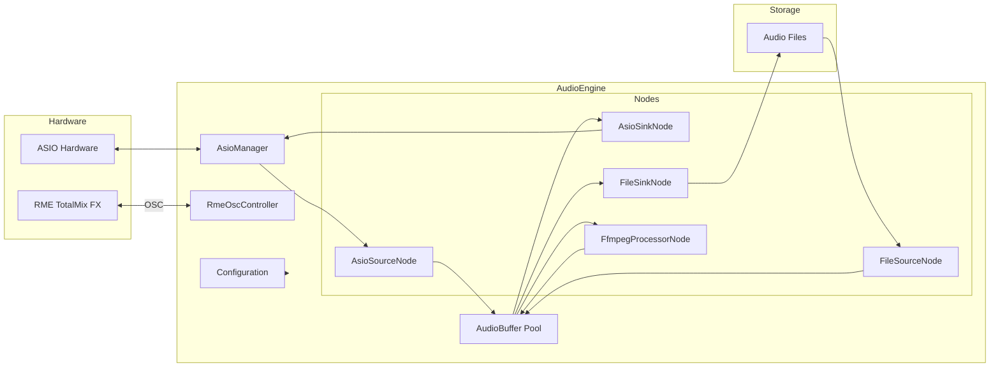
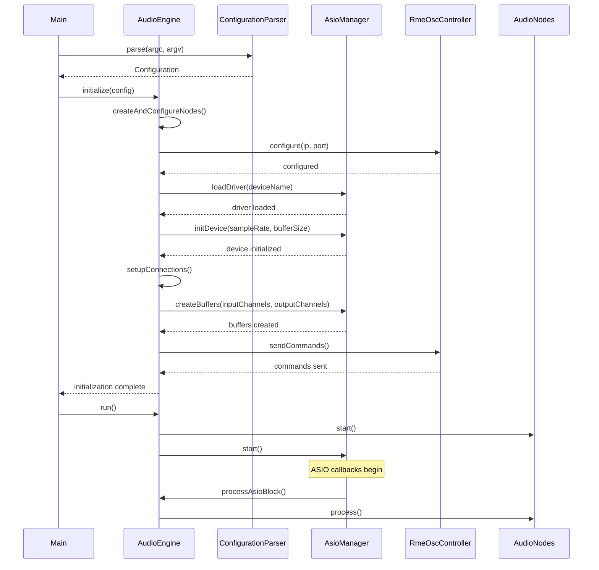
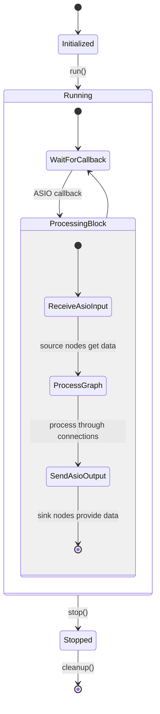

# Audio Engine Architecture

## Class Interaction Diagram

```mermaid
classDiagram
    %% Main Engine Coordinator
    AudioEngine *-- "1" AsioManager : manages
    AudioEngine *-- "1" RmeOscController : manages
    AudioEngine *-- "many" AudioNode : owns
    AudioEngine *-- "many" Connection : contains
    AudioEngine --> Configuration : configured by

    %% Node Hierarchy
    AudioNode <|-- AsioSourceNode
    AudioNode <|-- AsioSinkNode
    AudioNode <|-- FileSourceNode
    AudioNode <|-- FileSinkNode
    AudioNode <|-- FfmpegProcessorNode

    %% Buffer Handling
    AudioNode --> AudioBuffer : produces/consumes
    AsioSourceNode --> AudioBuffer : produces
    AsioSinkNode --> AudioBuffer : consumes
    FileSourceNode --> AudioBuffer : produces
    FileSinkNode --> AudioBuffer : consumes
    FfmpegProcessorNode --> AudioBuffer : transforms

    %% Hardware Interfaces
    AsioSourceNode --> AsioManager : receives data from
    AsioSinkNode --> AsioManager : sends data to
    FfmpegProcessorNode --> FfmpegFilter : uses
    RmeOscController --> "liblo" : uses

    %% Configuration
    ConfigurationParser --> Configuration : creates

    %% Connection Between Nodes
    Connection --> AudioNode : connects

    %% Class Definitions
    class AudioEngine {
        -Configuration m_config
        -AsioManager* m_asioManager
        -RmeOscController* m_rmeController
        -vector~AudioNode*~ m_nodes
        -vector~Connection~ m_connections
        +initialize(Configuration)
        +run()
        +stop()
        +processAsioBlock(long)
    }

    class AudioNode {
        <<abstract>>
        #string m_name
        #NodeType m_type
        #AudioEngine* m_engine
        +configure(params, sampleRate, bufferSize, format, layout)
        +start()
        +process()
        +stop()
        +getOutputBuffer(padIndex)
        +setInputBuffer(buffer, padIndex)
    }

    class AudioBuffer {
        -vector~uint8_t*~ data
        -long frames
        -double sampleRate
        -AVSampleFormat format
        -AVChannelLayout channelLayout
        +allocate(frames, sampleRate, format, layout)
        +free()
        +copyFrom(buffer)
    }

    class AsioManager {
        -long m_bufferSize
        -double m_sampleRate
        -ASIOSampleType m_sampleType
        +loadDriver(deviceName)
        +initDevice(sampleRate, bufferSize)
        +createBuffers(inputChannels, outputChannels)
        +start()
        +stop()
        +setCallback(callback)
    }

    class RmeOscController {
        -string m_rmeIp
        -int m_rmePort
        -lo_address m_oscAddress
        +configure(ip, port)
        +sendCommand(address, args)
        +setMatrixCrosspointGain(input, output, gain)
    }

    class AsioSourceNode {
        -AsioManager* m_asioMgr
        -vector~long~ m_asioChannelIndices
        -AudioBuffer m_outputBuffer
        +receiveAsioData(doubleBufferIndex, asioBuffers)
        +getOutputBuffer(padIndex)
    }

    class AsioSinkNode {
        -AsioManager* m_asioMgr
        -vector~long~ m_asioChannelIndices
        -AudioBuffer m_inputBuffer
        +setInputBuffer(buffer, padIndex)
        +provideAsioData(doubleBufferIndex, asioBuffers)
    }

    class FileSourceNode {
        -string m_filePath
        -thread m_readerThread
        -queue~AudioBuffer~ m_outputQueue
        +start()
        +stop()
        +getOutputBuffer(padIndex)
    }

    class FileSinkNode {
        -string m_filePath
        -thread m_writerThread
        -queue~AudioBuffer~ m_inputQueue
        +start()
        +stop()
        +setInputBuffer(buffer, padIndex)
    }

    class FfmpegProcessorNode {
        -FfmpegFilter* m_ffmpegFilter
        -string m_filterDesc
        -AudioBuffer m_inputBuffer
        -AudioBuffer m_outputBuffer
        +process()
        +updateParameter(filterName, paramName, value)
    }

    class FfmpegFilter {
        -AVFilterGraph* m_graph
        -AVFilterContext* m_srcContext
        -AVFilterContext* m_sinkContext
        +initGraph(filterDescription, sampleRate, format, layout)
        +process(inputFrame, outputFrame)
        +updateParameter(filterName, paramName, value)
    }

    class Configuration {
        +string asioDeviceName
        +string rmeOscIp
        +int rmeOscPort
        +double sampleRate
        +long bufferSize
        +vector~NodeConfig~ nodes
        +vector~ConnectionConfig~ connections
    }

    class ConfigurationParser {
        +parse(argc, argv, config)
        +parseFromFile(filePath, config)
    }

    class Connection {
        +AudioNode* sourceNode
        +int sourcePad
        +AudioNode* sinkNode
        +int sinkPad
    }
```

## Data Flow Diagram



## Initialization Sequence



## Processing Flow


