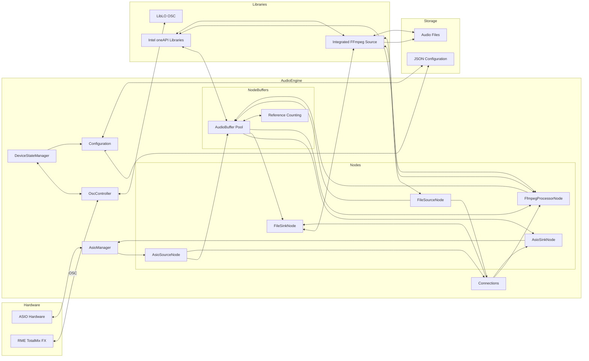
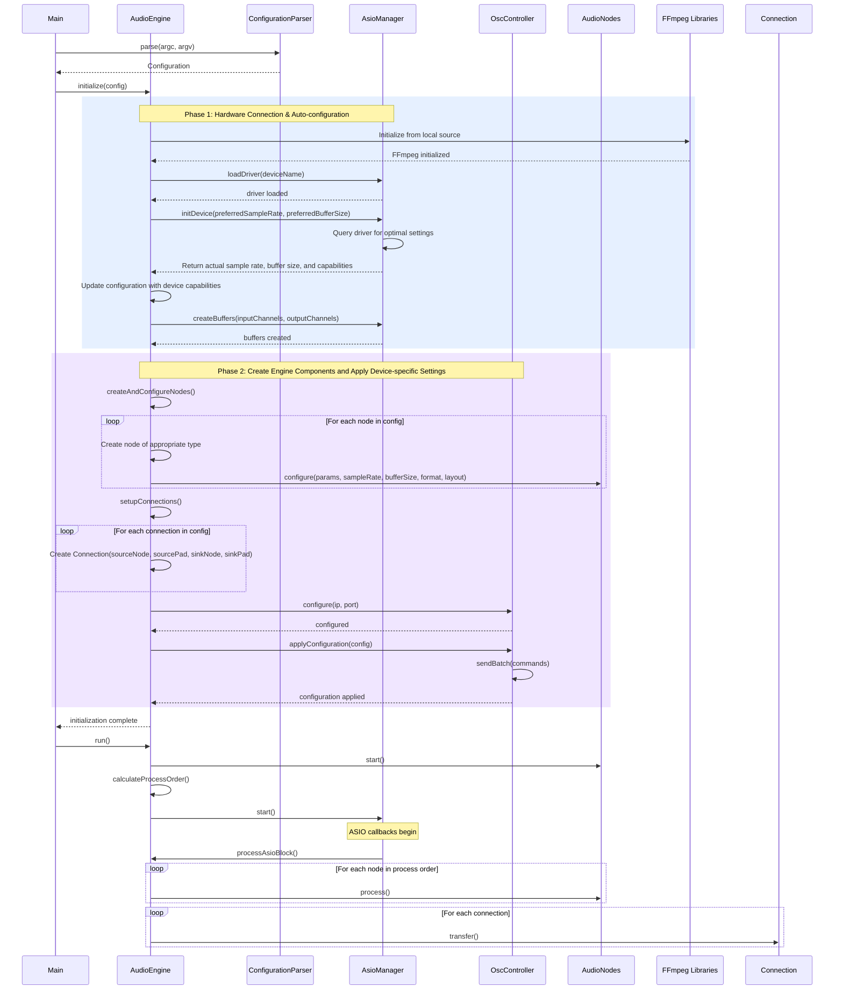
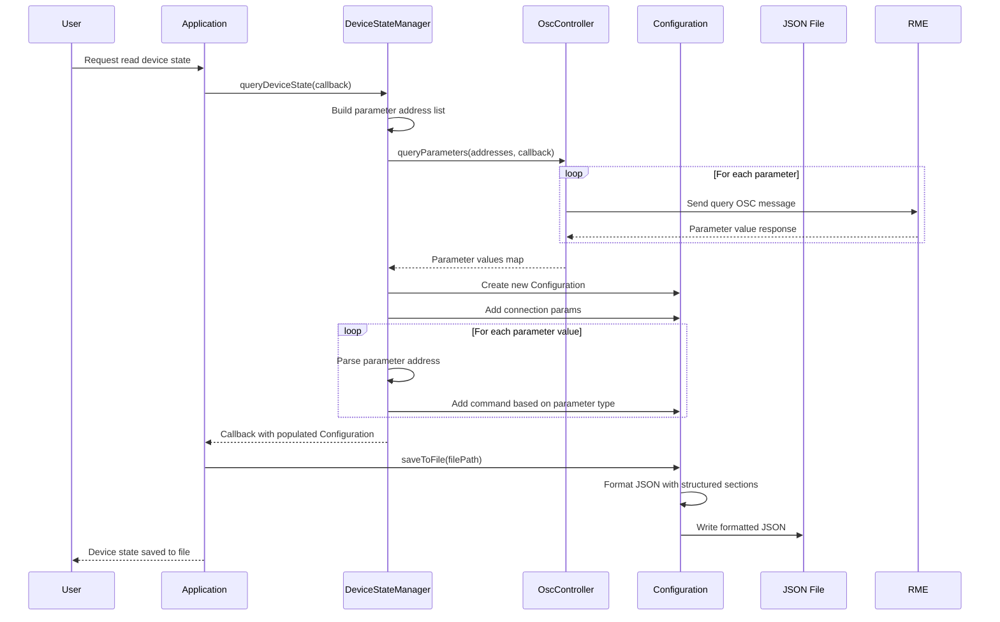
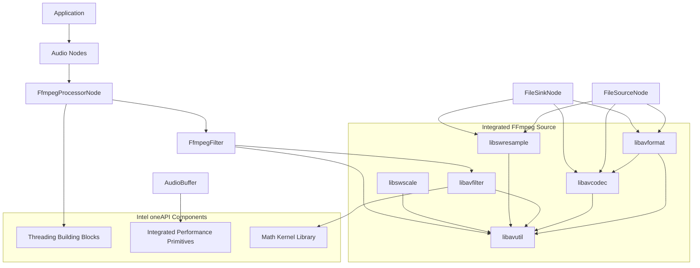
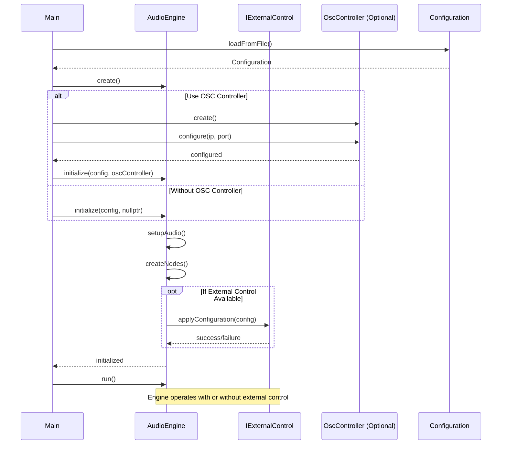

# Audio Engine Architecture

## Class Interaction Diagram

```mermaid
classDiagram
    %% Main Engine Coordinator
    AudioEngine *-- "1" AsioManager : manages
    AudioEngine *-- "1" OscController : manages
    AudioEngine *-- "many" AudioNode : owns
    AudioEngine *-- "many" Connection : contains
    AudioEngine --> Configuration : configured by

    %% Node Hierarchy
    AudioNode <|-- AsioSourceNode
    AudioNode <|-- AsioSinkNode
    AudioNode <|-- FileSourceNode
    AudioNode <|-- FileSinkNode
    AudioNode <|-- FfmpegProcessorNode

    %% Buffer Handling
    AudioNode --> AudioBuffer : produces/consumes
    AsioSourceNode --> AudioBuffer : produces
    AsioSinkNode --> AudioBuffer : consumes
    FileSourceNode --> AudioBuffer : produces
    FileSinkNode --> AudioBuffer : consumes
    FfmpegProcessorNode --> AudioBuffer : transforms

    %% Hardware Interfaces
    AsioSourceNode --> AsioManager : receives data from
    AsioSinkNode --> AsioManager : sends data to
    FfmpegProcessorNode --> FfmpegFilter : uses
    OscController --> "liblo" : uses
    FileSourceNode --> "FFmpegSource" : reads from
    FileSinkNode --> "FFmpegSource" : writes to

    %% Configuration
    ConfigurationParser --> Configuration : creates
    DeviceStateManager --> Configuration : generates
    DeviceStateManager --> OscController : queries

    %% Connection Between Nodes
    Connection --> AudioNode : connects

    %% Reference Counting
    AudioBuffer --> "shared_ptr" : uses for reference counting

    %% Class Definitions
    class AudioEngine {
        -Configuration m_config
        -AsioManager* m_asioManager
        -OscController* m_oscController
        -vector~AudioNode*~ m_nodes
        -vector~Connection~ m_connections
        -map~string, AudioNode*~ m_nodeMap
        -vector~AudioNode*~ m_processOrder
        +initialize(Configuration)
        +run()
        +stop()
        +processAsioBlock(long, bool)
        +getNodeByName(string)
        +getOscController()
    }

    class AudioNode {
        <<abstract>>
        #string m_name
        #NodeType m_type
        #AudioEngine* m_engine
        #double m_sampleRate
        #long m_bufferSize
        #AVSampleFormat m_format
        #AVChannelLayout m_channelLayout
        #bool m_configured
        #bool m_running
        #string m_lastError
        +configure(params, sampleRate, bufferSize, format, layout)
        +start()
        +process()
        +stop()
        +getOutputBuffer(padIndex)
        +setInputBuffer(buffer, padIndex)
        +getInputPadCount()
        +getOutputPadCount()
        +updateParameter(paramName, paramValue)
        +isConfigured()
        +isRunning()
        +isBufferFormatCompatible(buffer)
        +getLastError()
    }

    class AudioBuffer {
        -vector~vector~uint8_t~~ m_data
        -long m_frames
        -double m_sampleRate
        -AVSampleFormat m_format
        -AVChannelLayout m_channelLayout
        -atomic~int~ m_refCount
        +allocate(frames, sampleRate, format, layout)
        +free()
        +copyFrom(buffer)
        +getPlaneData(plane)
        +createReference()
        +isValid()
    }

    class AsioManager {
        -long m_bufferSize
        -double m_sampleRate
        -ASIOSampleType m_sampleType
        +loadDriver(deviceName)
        +initDevice(sampleRate, bufferSize)
        +createBuffers(inputChannels, outputChannels)
        +start()
        +stop()
        +setCallback(callback)
    }

    class OscController {
        -string m_targetIp
        -int m_targetPort
        -lo_server_thread m_oscServer
        +sendCommand(address, args)
        +startReceiver(port)
        +setMatrixCrosspointGain(input, output, gain)
        +setChannelVolume(channelType, channel, volumeDb)
        +setChannelMute(channelType, channel, mute)
        +queryChannelVolume(channelType, channel, volumeDb)
        +applyConfiguration(config)
        +getTargetIp()
        +getTargetPort()
    }

    class AsioSourceNode {
        -AsioManager* m_asioMgr
        -vector~long~ m_asioChannelIndices
        -shared_ptr~AudioBuffer~ m_outputBuffer
        -mutex m_bufferMutex
        +receiveAsioData(doubleBufferIndex, asioBuffers)
        +getOutputBuffer(padIndex)
    }

    class AsioSinkNode {
        -AsioManager* m_asioMgr
        -vector~long~ m_asioChannelIndices
        -shared_ptr~AudioBuffer~ m_inputBuffer
        -mutex m_bufferMutex
        +setInputBuffer(buffer, padIndex)
        +provideAsioData(doubleBufferIndex, asioBuffers)
    }

    class FileSourceNode {
        -string m_filePath
        -thread m_readerThread
        -queue~shared_ptr~AudioBuffer~~ m_outputQueue
        -mutex m_queueMutex
        -condition_variable m_queueCondVar
        -AVFormatContext* m_formatCtx
        -AVCodecContext* m_codecCtx
        +start()
        +stop()
        +getOutputBuffer(padIndex)
        +seekTo(position)
        +getCurrentPosition()
        +getDuration()
    }

    class FileSinkNode {
        -string m_filePath
        -thread m_writerThread
        -queue~shared_ptr~AudioBuffer~~ m_inputQueue
        -mutex m_queueMutex
        -condition_variable m_queueCondVar
        -AVFormatContext* m_formatCtx
        -AVCodecContext* m_codecCtx
        +start()
        +stop()
        +setInputBuffer(buffer, padIndex)
        +flush()
    }

    class FfmpegProcessorNode {
        -FfmpegFilter m_ffmpegFilter
        -string m_filterDescription
        -AVFrame* m_inputFrame
        -AVFrame* m_outputFrame
        -shared_ptr~AudioBuffer~ m_inputBuffer
        -shared_ptr~AudioBuffer~ m_outputBuffer
        -mutex m_processMutex
        +process()
        +updateParameter(paramName, paramValue)
        +updateParameter(filterName, paramName, value)
    }

    class FfmpegFilter {
        -AVFilterGraph* m_graph
        -AVFilterContext* m_srcContext
        -AVFilterContext* m_sinkContext
        -map~string, AVFilterContext*~ m_namedFilters
        +initGraph(filterDescription, sampleRate, format, layout)
        +process(inputFrame, outputFrame)
        +updateParameter(filterName, paramName, value)
    }

    class Configuration {
        +string asioDeviceName
        +string rmeOscIp
        +int rmeOscPort
        +double sampleRate
        +long bufferSize
        +vector~NodeConfig~ nodes
        +vector~ConnectionConfig~ connections
        +vector~OscCommandConfig~ rmeCommands
        +loadFromFile(filePath)
        +saveToFile(filePath)
        +toJsonString()
        +setConnectionParams(ip, port, receivePort)
        +getTargetIp()
        +getTargetPort()
        +getReceivePort()
        +setMatrixCrosspointGain(input, output, gainDb)
        +setChannelMute(channelType, channel, mute)
        +setChannelVolume(channelType, channel, volumeDb)
        +getCommands()
        +addCommand(address, args)
        +clearCommands()
    }

    class ConfigurationParser {
        +parse(argc, argv, config)
        +parseFromFile(filePath, config)
        +parseJson(content, config)
    }

    class Connection {
        +AudioNode* sourceNode
        +int sourcePad
        +AudioNode* sinkNode
        +int sinkPad
        +transfer()
        +toString()
    }

    class DeviceStateManager {
        +DeviceStateManager(OscController*)
        +queryDeviceState(callback, channelCount)
        +queryParameter(address, callback)
        +queryParameters(addresses, callback)
    }
```

## Data Flow Diagram



## Initialization Sequence



## Device State Management Flow



## FFmpeg Integration Architecture



## Decoupled Component Architecture

```mermaid
classDiagram
    %% Interface for external control
    class IExternalControl {
        <<interface>>
        +setParameter(address, args)
        +getParameter(address, callback)
        +applyConfiguration(config)
        +queryDeviceState(callback)
        +addEventCallback(callback)
        +removeEventCallback(id)
    }

    %% Main components with loose coupling
    AudioEngine o-- IExternalControl : uses optionally
    OscController ..|> IExternalControl : implements

    %% Configuration system
    Configuration <-- AudioEngine : uses
    Configuration <-- OscController : uses

    %% Hardware interfaces remain unchanged
    AsioManager <-- AudioEngine : manages
    AudioEngine o-- "many" AudioNode : owns

    %% OscController can operate independently
    OscController --> "liblo" : uses

    %% Class details
    class AudioEngine {
        -std::shared_ptr~IExternalControl~ m_externalControl
        +initialize(config, externalControl)
        +setExternalControl(control)
        +clearExternalControl()
        +sendExternalCommand(address, args)
    }

    class OscController {
        +configure(configFile)
        +configure(targetIp, targetPort, receivePort)
        +static main(argc, argv)
    }

    class Configuration {
        +loadAudioConfigFromFile(path)
        +loadControlConfigFromFile(path)
        +getAudioConfiguration()
        +getControlConfiguration()
    }
```

## Standalone vs Integrated Operation

```mermaid
flowchart TD
    subgraph "Standalone Operation"
        A[OscController Executable] --> B[OscController]
        B --> C[liblo OSC Library]
        B --> D[Device Communication]
    end

    subgraph "Integrated Operation"
        E[Main Application] --> F[AudioEngine]
        E --> G[OscController]
        F -.-> |Optional| G
        F --> H[AsioManager]
        F --> I[Audio Nodes]
        G --> J[liblo OSC Library]
        G --> K[Device Communication]
    end

    subgraph "Shared Components"
        L[Configuration System]
        M[IExternalControl Interface]
        G ..|> M
        F --> L
        G --> L
    end
```

## Component Initialization Sequence


