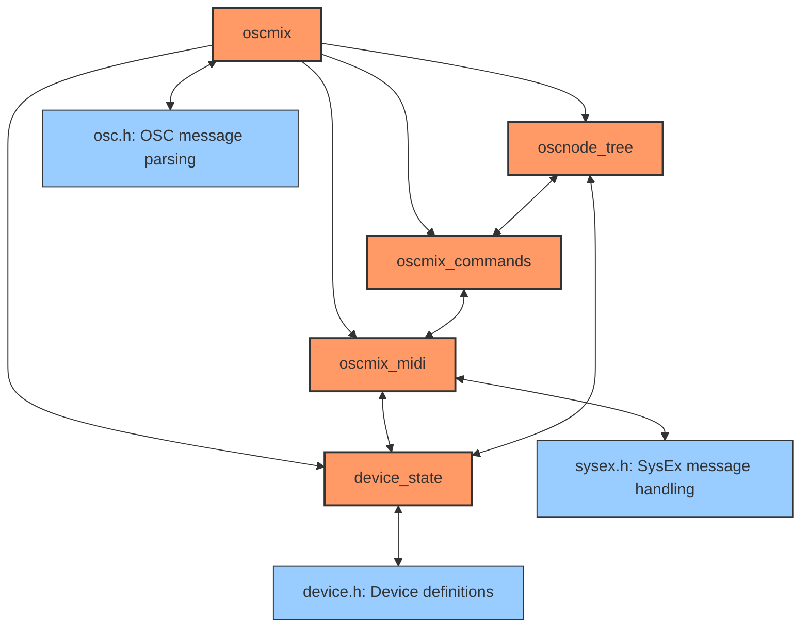

# OSCMix Architecture and Processing Flow

This document illustrates the core architecture and processing flow of OSCMix, which bridges OSC (Open Sound Control) messages with RME audio interface controls using MIDI SysEx commands.

## Modular Architecture

OSCMix is structured around these core modules:



```mermaid
flowchart TD
    A[Program Start] --> A1[platform_init(): Initialize platform-specific services]
    A1 --> B[device_init(): Initialize device parameters]
    B --> B1[device_state_init(): Initialize device state structure]
    B1 --> B2[oscnode_tree_init(): Initialize parameter tree]
    B2 --> C[Initialize channel structures in device_state]
    C --> D[osc_server_init(): Set up OSC message handling]
    D --> E[Main Loop: osc_server_poll() for incoming messages]
    E --> F{Incoming OSC Message?}
    F -- No --> E
    F -- Yes --> G[oscmsg_parse(): Parse OSC address pattern and arguments]
    G --> H{Message Command Type}

    %% Parameter Setting Flow
    H -- Set Parameter '/path value' --> I[oscnode_find(): Locate parameter in tree]
    I --> I1[Command handler from oscmix_commands.c]
    I1 --> I2{Parameter Type}
    I2 --> I3[setint(): Set integer parameter]
    I2 --> I4[setfixed(): Set fractional value parameter]
    I2 --> I5[setenum(): Set enumerated value parameter]
    I2 --> I6[setbool(): Set boolean parameter]
    I2 --> I7[setOther(): Other parameter-specific handlers]
    I3 --> J[setreg(): Format and send SysEx register command]
    I4 --> J
    I5 --> J
    I6 --> J
    I7 --> J
    J --> J1[Update device_state with new values]
    J1 --> K[oscsend(): Send acknowledgment/notification back to client]
    K --> E

    %% Parameter Query Flow
    H -- Get Parameter '/path' --> L[oscnode_find(): Locate parameter in tree]
    L --> L1[Get current value from device_state]
    L1 --> L2{Parameter Type}
    L2 --> L3[newint(): Format integer response]
    L2 --> L4[newfixed(): Format fractional value response]
    L2 --> L5[newenum(): Format enumerated value response]
    L2 --> L6[newbool(): Format boolean response]
    L3 --> M[oscsend(): Send parameter value to client]
    L4 --> M
    L5 --> M
    L6 --> M
    M --> E

    %% Special Commands Flow
    H -- Special Command --> N{Command Type}
    N -- "/refresh" --> O[setrefresh(): Request full device state refresh]
    O --> O1[setreg(REFRESH_ADDR, MAGIC_VALUE): Send refresh command to device]
    O1 --> E

    N -- "/dump" --> P[dumpDeviceState(): Debug function to display internal state]
    P --> E

    N -- "/dump/save" --> P1[dumpConfig(): Save state to JSON file]
    P1 --> P7[Send success/failure notification]
    P7 --> E

    %% SysEx Response Processing
    S[MIDI SysEx Response from Device] --> T[handlesysex(): Process device response]
    T --> U{SysEx Message Type}
    U -- Register Values --> V[handleregs(): Update internal state with register values]
    V --> V1[Update device_state with received values]
    V1 --> W[Send OSC notifications for changed parameters]
    W --> E

    U -- Level Meters --> X[handlelevels(): Process level meter data]
    X --> Y[Format and send level meter OSC messages]
    Y --> E

    %% Error handling
    G -- Invalid/Unknown --> Z[osc_error(): Handle malformed message]
    Z --> E
```

## Core Component Descriptions

### Initialization

- **device_init()**: Detects the connected RME device and initializes the parameter mapping structure
- **inputs_init()**, **outputs_init()**, **playbacks_init()**: Set up state tracking structures for different channel types

### OSC Message Processing

- **oscmsg_parse()**: Extracts address pattern and arguments from incoming OSC message packets
- **dispatch_set()**, **dispatch_get()**: Find parameter in the parameter tree and call appropriate handlers
- **setreg()**: Core function that formats and sends MIDI SysEx commands to update device registers
- **setint()**, **setfixed()**, **setenum()**, **setbool()**: Type-specific parameter value setting and validation

### MIDI Response Handling

- **handlesysex()**: Processes SysEx responses received from the device
- **handleregs()**: Updates internal state based on register values received from the device
- **handlelevels()**: Processes level meter data and sends it as OSC messages

### Special Commands

- **setrefresh()**: Initiates a full device state refresh
- **oscsendenum()**: Returns the list of possible values for enumerated parameters
- **dump()**: Debugging tool that prints internal state information

### OSC Message Generation

- **oscsend()**: Formats and sends OSC messages to notify clients of state changes
- **newint()**, **newfixed()**, **newenum()**, **newbool()**: Type-specific response formatting

## Data Flow

1. OSC messages arrive from the network
2. Messages are parsed and dispatched to appropriate handlers
3. Parameters are validated and converted to device-specific values
4. MIDI SysEx commands are sent to the device
5. Device responses are processed and state is updated
6. Clients are notified of state changes via OSC messages

## Error Handling

- Invalid messages and parameters are rejected with appropriate error responses
- SysEx communication errors are detected and reported
- Device state is maintained consistently between client and hardware

Core Module Responsibilities
oscmix.c/h
Main entry point and coordination
Process incoming messages and route to appropriate handlers
Delegate specialized tasks to other modules
oscnode_tree.c/h
Define the parameter tree structure
Provide pattern matching and node lookup functions
Map OSC addresses to device registers
oscmix_commands.c/h
Implement parameter setting command handlers
Validate parameter values
Convert between OSC data types and device values
Special commands like refresh, dump, etc.
oscmix_midi.c/h
Format and send SysEx messages to the device
Process SysEx responses from the device
Generate OSC messages for state updates and notifications
Handle level meter data
device_state.c/h
Maintain internal representation of device state
Track all parameter values
Provide accessor functions for state querying/updating
device.c/h
Define device-specific capabilities and limitations
Device detection and identification
Structure definitions for different device models
Key Functions by Module
oscmix.c
init(): Initialize the application
handlesysex(): Entry point for SysEx message processing
handleosc(): Entry point for OSC message processing
handletimer(): Periodic tasks like level updates
oscnode_tree.c
oscnode_tree_init(): Initialize the parameter tree
oscnode_find(): Find a node in the tree by OSC address
match(): Pattern matching for OSC addresses
oscmix_commands.c
setint(), setfixed(), setenum(), setbool(): Type-specific parameter handlers
setrefresh(): Command to request device state refresh
Special parameter handlers: setinputgain(), setmix(), etc.
oscmix_midi.c
setreg(): Send register updates to the device
handleregs(): Process register values from the device
handlelevels(): Process level meter data
oscsend(): Send OSC messages to clients
newint(), newfixed(), newenum(), newbool(): Format OSC responses
device_state.c
device_state_init(): Initialize state tracking
getXXX(), setXXX(): State accessor functions
dumpDeviceState(): Debug function to display state
dumpConfig(): Save state to a file
Data Flow
OSC messages arrive and are processed by oscmix.c
Parameter path is resolved using oscnode_tree.c
Parameter value is validated by handlers in oscmix_commands.c
Commands are sent to the device via oscmix_midi.c
Device state is updated in device_state.c
Notifications are sent back to clients via oscmix_midi.c
Error Handling
Invalid messages and parameters are rejected with appropriate error responses
SysEx communication errors are detected and reported
Device state is maintained consistently between client and hardware
