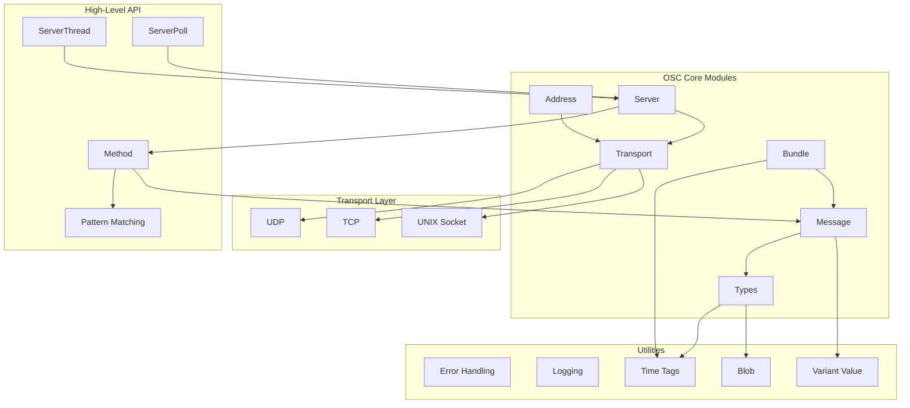

# Modern C++ OSC Library Architecture

This document outlines the architecture of our modern C++ implementation of the Open Sound Control (OSC) protocol. The library is designed with SOLID principles, modern C++ features, and cross-platform compatibility in mind.

## Core Architecture

## Module Dependencies and Responsibilities

### Core Data Types (`Types.h`)

- Defines fundamental data types used across the library
- Includes TimeTag, Blob, Value (variant type), and Protocol enums
- Provides exception classes for error handling
- Implements value conversions and type checking utilities

### Value System (`Value`)

- Uses `std::variant` to represent all OSC argument types
- Provides type-safe access to values
- Handles serialization and deserialization of each type
- Implements appropriate alignment and padding rules

### Message Class (`Message`)

- Represents an OSC message with address pattern, type tag, and arguments
- Provides methods to add and retrieve arguments in a type-safe manner
- Handles serialization to and deserialization from binary format
- Implements PIMPL pattern for ABI stability

### Bundle Class (`Bundle`)

- Contains multiple messages or nested bundles with a time tag
- Manages bundled element storage and lifetime
- Handles serialization and proper OSC bundle formatting
- Provides iteration over contained elements

### Address Class (`Address`)

- Manages network connection information (host, port, protocol)
- Creates appropriate socket connections based on protocol
- Handles address resolution and URL parsing
- Uses PIMPL pattern with platform-specific implementations

### Transport System (`Transport`)

- Abstract interface for different transport methods
- Concrete implementations for UDP, TCP, and UNIX domain sockets
- Handles protocol-specific details (SLIP encoding for TCP, etc.)
- Provides connection management and error reporting

### Server Class (`Server`)

- Listens for incoming OSC messages on specified ports
- Dispatches messages to registered handlers based on address patterns
- Handles bundle processing with proper timing
- Manages method registration and pattern matching

### Method Class (`Method`)

- Represents a callback for a specific OSC address pattern
- Handles pattern matching against incoming messages
- Supports different matching methods (exact, wildcard, parameter extraction)
- Dispatches messages to user-defined callbacks

### High-Level Server Variants

- **ServerThread**: Server running in a dedicated thread
- **ServerPoll**: Server that can be manually polled for messages

### Pattern Matching System (`Pattern`)

- Implements OSC pattern matching rules
- Supports wildcards, character classes, and alternatives
- Provides utilities for path parameter extraction
- Optimizes common pattern matching cases

## Implementation Details

### Modern C++ Features

- Uses C++17 features including `std::variant`, `std::optional`, and structured bindings
- Employs RAII for resource management
- Implements move semantics for efficient resource transfers
- Uses smart pointers for memory management
- Provides iterator interfaces where appropriate

### Cross-Platform Considerations

- Abstracts platform-specific socket APIs
- Handles endianness conversion consistently
- Addresses differences in threading models
- Accommodates filesystem path variations
- Uses conditional compilation only when necessary

### Design Patterns

- **PIMPL** (Pointer to Implementation): Hides implementation details and ensures ABI stability
- **Factory Methods**: Creates objects with proper initialization
- **Observer**: For event notification in the server architecture
- **Strategy**: For different pattern matching algorithms
- **Adapter**: For interfacing with system-specific APIs

### Error Handling Strategy

- Uses exceptions for initialization and construction errors
- Provides error codes and status returns for runtime errors
- Includes detailed error messages and context information
- Offers callback-based error notification for servers

## Thread Safety Considerations

- Thread-safe server implementations
- Immutable message and bundle objects
- Explicit synchronization for shared resources
- Clear documentation of thread safety guarantees
