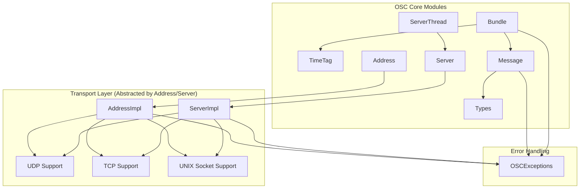

# Modern C++ OSC Library Architecture

This document outlines the architecture of our modern C++ implementation of the Open Sound Control (OSC) protocol. The library is designed with SOLID principles, modern C++ features, and cross-platform compatibility in mind.

## Core Architecture



## Component Overview

### Core Components

- **[OSC.h](include/osc/OSC.h)**: Main include file for the library, providing a convenient single header to include all components.
- **[Types.h](include/osc/Types.h)**: Defines fundamental types and enumerations used throughout the library.
- **[TimeTag.h](include/osc/TimeTag.h)** / **[TimeTag.cpp](src/TimeTag.cpp)**: Implements OSC time tags for message scheduling.
- **[Message.h](include/osc/Message.h)** / **[Message.cpp](src/Message.cpp)**: Core class for creating, manipulating, and serializing OSC messages.
- **[Bundle.h](include/osc/Bundle.h)** / **[Bundle.cpp](src/Bundle.cpp)**: Implements OSC bundles for grouping messages with a common time tag.
- **[Address.h](include/osc/Address.h)** / **[Address.cpp](src/Address.cpp)**: Client-side class for sending OSC messages to a specific destination.
- **[Server.h](include/osc/Server.h)** / **[Server.cpp](src/Server.cpp)**: Server-side class for receiving and dispatching OSC messages.
- **[ServerThread.h](include/osc/ServerThread.h)** / **[ServerThread.cpp](src/ServerThread.cpp)**: Threaded wrapper for the Server class.

### Implementation Details

- **[AddressImpl.h](include/osc/AddressImpl.h)** / **[AddressImpl.cpp](src/AddressImpl.cpp)**: Implementation details for the Address class (PIMPL pattern).
- **[ServerImpl.h](include/osc/ServerImpl.h)** / **[ServerImpl.cpp](src/ServerImpl.cpp)**: Implementation details for the Server class (PIMPL pattern).
- **[Exceptions.h](include/osc/Exceptions.h)** / **[OSCException.cpp](src/OSCException.cpp)**: Exception handling for the library.
- **[Value.cpp](src/Value.cpp)**: Implementation of the OSC value system, supporting type conversions and serialization.
- **[main.cpp](src/main.cpp)**: Core library entry points including initialization, cleanup, and utility functions.

### Core Entry Points

The library is designed with an easy-to-use API:

```cpp
// Initialize the library
osc::initialize();

// Create and send a message
osc::Message message("/address/pattern");
message.addInt32(42).addFloat(3.14f).addString("hello");

osc::Address destination("localhost", "8000", osc::Protocol::UDP);
destination.send(message);

// Create a server to receive messages
osc::Server server("8000", osc::Protocol::UDP);
server.addMethod("/address/pattern", "", [](const osc::Message& msg) {
    // Handle incoming message
});

// Use ServerThread for background processing
osc::ServerThread thread(server);
thread.start();

// ...later...
thread.stop();

// Clean up when done
osc::cleanup();
```

## Design Patterns

The library employs several design patterns to promote maintainability and flexibility:

1. **PIMPL (Pointer to Implementation)**: Used in Address and Server classes to hide platform-specific details and maintain ABI compatibility.
2. **Factory Methods**: Static creation methods like `TimeTag::now()`, `TimeTag::immediate()`, and `Address::fromUrl()`.
3. **Builder Pattern**: Method chaining in Message and Bundle for fluent construction.
4. **Observer Pattern**: Callback-based message dispatching in Server.
5. **Façade Pattern**: OSC.h provides a simple interface to the entire library.

## Cross-Platform Support

Platform-specific code is isolated in the implementation files:

- Windows: Using Winsock2 for networking
- Unix/Linux: Using POSIX sockets
- macOS: Using BSD sockets with platform-specific extensions

The CMake build system ([CMakeLists.txt](CMakeLists.txt)) handles platform detection and configuration with platform-specific options in the [cmake](cmake) directory.

## Error Handling

The library employs a consistent error handling approach using custom exceptions:

- **OSCException**: Base exception class with error codes for different failure categories
- All public methods document their exception behavior
- Functions that may fail without being exceptional return boolean success indicators

## Memory Management

- Modern C++ smart pointers and RAII principles are used throughout
- Custom allocators are avoided in favor of standard containers
- Serialization functions avoid unnecessary copies with std::byte vectors

## Protocol Support

The library implements:

- OSC 1.0 and 1.1 specifications
- UDP transport (primary)
- TCP transport with packet framing
- UNIX domain sockets (where available)
- Full OSC type system including standard, extended, and array types

## Future Enhancements

See [TODO.md](TODO.md) for planned enhancements, including:

- WebSocket transport support
- OSC query support (zeroconf/discovery)
- Additional pattern matching algorithms
- Performance optimizations
